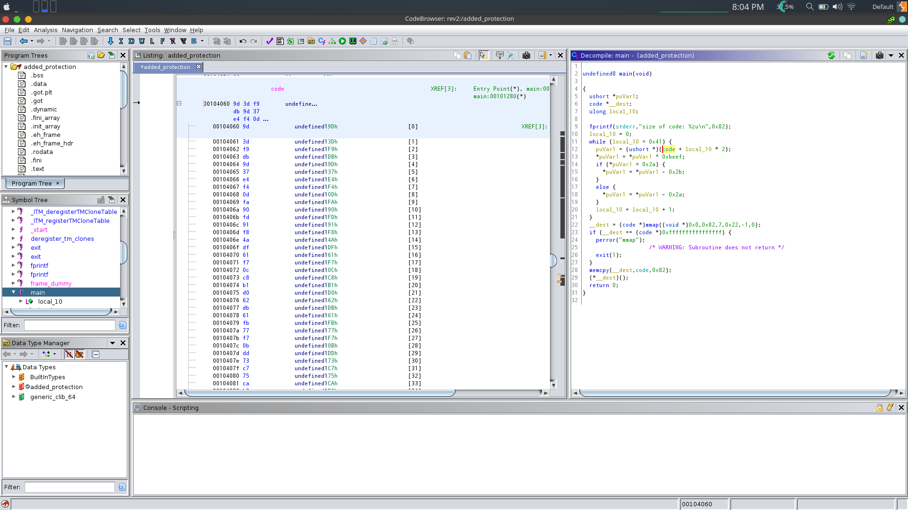
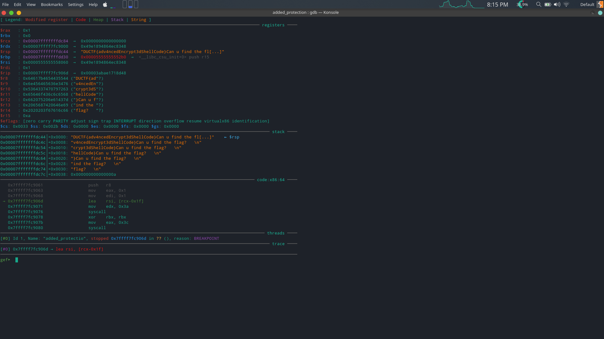

# Challenge Name : added protection

# Description : 

This binary has some e^tra added protection on the advanced 64bit shellcode

## Analysis of the binary

Upon running the binary, we find out that it just executes the `fprintf` and displays a message and exits.

```
 ./added_protection 
size of code: 130
Can u find the flag? 
```

If we look further into the decompilation of the binary we find out that a particular section called `code` is being loaded onto the binary.

```
undefined8 main(undefined8 argc, char **argv)
{
    uint16_t *puVar1;
    code *pcVar2;
    char **var_40h;
    int64_t var_34h;
    int64_t var_28h;
    undefined8 var_20h;
    undefined8 s1;
    undefined8 length;
    uint32_t var_8h;
    
    fprintf(_reloc.stderr, "size of code: %zu\n", 0x82);
    _var_8h = 0;
    while (_var_8h < 0x41) {
        puVar1 = (uint16_t *)(code + _var_8h * 2);
        *puVar1 = *puVar1 ^ 0xbeef;
        if (*puVar1 < 0x2a) {
            *puVar1 = *puVar1 - 0x2b;
        } else {
            *puVar1 = *puVar1 - 0x2a;
        }
        _var_8h = _var_8h + 1;
    }
    pcVar2 = (code *)mmap(0, 0x82, 7, 0x22, 0xffffffff, 0, argv);
    if (pcVar2 == (code *)0xffffffffffffffff) {
        perror("mmap");
        exit(1);
    }
    memcpy(pcVar2, code, 0x82);
    (*pcVar2)();
    return 0;
}
```

This is further confirmed when the disassembly is being checked.

```
[0x00001175]> pdf
            ; DATA XREF from entry0 @ 0x10ad
/ 308: int main (int argc, char **argv);
|           ; var char **var_40h @ rbp-0x40
|           ; var int64_t var_34h @ rbp-0x34
|           ; var int64_t var_2ch @ rbp-0x2c
|           ; var int64_t var_28h @ rbp-0x28
|           ; var size_t var_20h @ rbp-0x20
|           ; var size_t s1 @ rbp-0x18
|           ; var size_t length @ rbp-0x10
|           ; var uint32_t var_8h @ rbp-0x8
|           ; arg int argc @ rdi
|           ; arg char **argv @ rsi
|           0x00001175      55             push rbp
|           0x00001176      4889e5         mov rbp, rsp
|           0x00001179      4883ec40       sub rsp, 0x40
|           0x0000117d      897dcc         mov dword [var_34h], edi    ; argc
|           0x00001180      488975c0       mov qword [var_40h], rsi    ; argv
|           0x00001184      48c745f08200.  mov qword [length], 0x82
|           0x0000118c      488b056d2f00.  mov rax, qword [obj.stderr] ; obj.stderr__GLIBC_2.2.5
|                                                                      ; [0x4100:8]=0
|           0x00001193      488b55f0       mov rdx, qword [length]
|           0x00001197      488d35660e00.  lea rsi, str.size_of_code:__zu ; 0x2004 ; "size of code: %zu\n" ; const char *format
|           0x0000119e      4889c7         mov rdi, rax                ; FILE *stream
|           0x000011a1      b800000000     mov eax, 0
|           0x000011a6      e895feffff     call sym.imp.fprintf        ; int fprintf(FILE *stream, const char *format,   ...)
|           0x000011ab      48c745f80000.  mov qword [var_8h], 0
|       ,=< 0x000011b3      eb6e           jmp 0x1223
|       |   ; CODE XREF from main @ 0x122e
|      .--> 0x000011b5      488b45f8       mov rax, qword [var_8h]
|      :|   0x000011b9      488d1400       lea rdx, [rax + rax]
|      :|   0x000011bd      488d059c2e00.  lea rax, obj.code           ; 0x4060
|      :|   0x000011c4      4801d0         add rax, rdx
|      :|   0x000011c7      488945d8       mov qword [var_28h], rax
|      :|   0x000011cb      488b45d8       mov rax, qword [var_28h]
|      :|   0x000011cf      0fb700         movzx eax, word [rax]
|      :|   0x000011d2      6635efbe       xor ax, 0xbeef
|      :|   0x000011d6      89c2           mov edx, eax
|      :|   0x000011d8      488b45d8       mov rax, qword [var_28h]
|      :|   0x000011dc      668910         mov word [rax], dx
|      :|   0x000011df      488b45d8       mov rax, qword [var_28h]
|      :|   0x000011e3      0fb700         movzx eax, word [rax]
|      :|   0x000011e6      6683f829       cmp ax, 0x29
|     ,===< 0x000011ea      7721           ja 0x120d
|     |:|   0x000011ec      488b45d8       mov rax, qword [var_28h]
|     |:|   0x000011f0      0fb700         movzx eax, word [rax]
|     |:|   0x000011f3      0fb7c0         movzx eax, ax
|     |:|   0x000011f6      05ffff0000     add eax, 0xffff
|     |:|   0x000011fb      8945d4         mov dword [var_2ch], eax
|     |:|   0x000011fe      8b45d4         mov eax, dword [var_2ch]
|     |:|   0x00001201      8d50d6         lea edx, [rax - 0x2a]
|     |:|   0x00001204      488b45d8       mov rax, qword [var_28h]
|     |:|   0x00001208      668910         mov word [rax], dx
|    ,====< 0x0000120b      eb11           jmp 0x121e
|    ||:|   ; CODE XREF from main @ 0x11ea
|    |`---> 0x0000120d      488b45d8       mov rax, qword [var_28h]
|    | :|   0x00001211      0fb700         movzx eax, word [rax]
|    | :|   0x00001214      8d50d6         lea edx, [rax - 0x2a]
|    | :|   0x00001217      488b45d8       mov rax, qword [var_28h]
|    | :|   0x0000121b      668910         mov word [rax], dx
|    | :|   ; CODE XREF from main @ 0x120b
|    `----> 0x0000121e      488345f801     add qword [var_8h], 1
|      :|   ; CODE XREF from main @ 0x11b3
|      :`-> 0x00001223      488b45f0       mov rax, qword [length]
|      :    0x00001227      48d1e8         shr rax, 1
|      :    0x0000122a      483945f8       cmp qword [var_8h], rax
|      `==< 0x0000122e      7285           jb 0x11b5
|           0x00001230      488b45f0       mov rax, qword [length]
|           0x00001234      41b900000000   mov r9d, 0                  ; size_t offset
|           0x0000123a      41b8ffffffff   mov r8d, 0xffffffff         ; -1 ; int fd
|           0x00001240      b922000000     mov ecx, 0x22               ; '"' ; int flags
|           0x00001245      ba07000000     mov edx, 7                  ; int prot
|           0x0000124a      4889c6         mov rsi, rax                ; size_t length
|           0x0000124d      bf00000000     mov edi, 0                  ; void*addr
|           0x00001252      e8d9fdffff     call sym.imp.mmap           ; void*mmap(void*addr, size_t length, int prot, int flags, int fd, size_t offset)
|           0x00001257      488945e8       mov qword [s1], rax
|           0x0000125b      48837de8ff     cmp qword [s1], 0xffffffffffffffff
|       ,=< 0x00001260      7516           jne 0x1278
|       |   0x00001262      488d3dae0d00.  lea rdi, str.mmap           ; 0x2017 ; "mmap" ; const char *s
|       |   0x00001269      e8f2fdffff     call sym.imp.perror         ; void perror(const char *s)
|       |   0x0000126e      bf01000000     mov edi, 1                  ; int status
|       |   0x00001273      e8f8fdffff     call sym.imp.exit           ; void exit(int status)
|       |   ; CODE XREF from main @ 0x1260
|       `-> 0x00001278      488b55f0       mov rdx, qword [length]     ; size_t n
|           0x0000127c      488b45e8       mov rax, qword [s1]
|           0x00001280      488d35d92d00.  lea rsi, obj.code           ; 0x4060 ; const void *s2
|           0x00001287      4889c7         mov rdi, rax                ; void *s1
|           0x0000128a      e8c1fdffff     call sym.imp.memcpy         ; void *memcpy(void *s1, const void *s2, size_t n)
|           0x0000128f      488b45e8       mov rax, qword [s1]
|           0x00001293      488945e0       mov qword [var_20h], rax
|           0x00001297      488b55e0       mov rdx, qword [var_20h]
|           0x0000129b      b800000000     mov eax, 0
|           0x000012a0      ffd2           call rdx
|           0x000012a2      b800000000     mov eax, 0
|           0x000012a7      c9             leave
\           0x000012a8      c3             ret
```

A particular section called code is being loaded onto the registers and then XORed with `0xbeef`.

After that if the result is lesser than `0x2a` then `0x2b` is subtracted else `0x2a` is subtracted. 


## Checking out the code section 

Using Ghidra I took a look into the `code` section of the binary, which is being loaded.



It shows that there is a bunch of values there. It looks like some shellcodes.

## Rabbit hole

I thought that I could extract the shellcode from there and execute them through a C program binary and it would give me the flag. But it wasn't so, it contained all kinds of bad instructions which eventually led to segfaults. There I also tried with the XOR operations, but to no avail.

## Correct solution

If you look at the disassembly of the main function, you will find that there is a `call rdx` instruction, which means that a certain piece of code is being loaded onto `rdx` and then executed. So, I put a breakpoint there and ran the program

```
gef➤  break *main+299
gef➤  r
```

Now, move one step into the function call.

```
gef➤  si
```
This will take you to another code section. Now, display 100 instruction ahead : 

```
gef➤  x/100i $rip
```

```
ef➤  x/100i $rip
=> 0x7ffff7fc9000:      sub    rsp,0x64
   0x7ffff7fc9004:      mov    rcx,rsp
   0x7ffff7fc9007:      movabs r8,0x64617b4654435544
   0x7ffff7fc9011:      movabs r9,0x6e456465636e3476
   0x7ffff7fc901b:      movabs r10,0x5364337470797263
   0x7ffff7fc9025:      movabs r11,0x65646f436c6c6568
   0x7ffff7fc902f:      movabs r12,0x662075206e61437d
   0x7ffff7fc9039:      movabs r13,0x2065687420646e69
   0x7ffff7fc9043:      movabs r14,0x2020203f67616c66
   0x7ffff7fc904d:      mov    r15d,0xa
   0x7ffff7fc9053:      push   r15
   0x7ffff7fc9055:      push   r14
   0x7ffff7fc9057:      push   r13
   0x7ffff7fc9059:      push   r12
   0x7ffff7fc905b:      push   r11
   0x7ffff7fc905d:      push   r10
   0x7ffff7fc905f:      push   r9
   0x7ffff7fc9061:      push   r8
   0x7ffff7fc9063:      mov    eax,0x1
   0x7ffff7fc9068:      mov    edi,0x1
   0x7ffff7fc906d:      lea    rsi,[rcx-0x1f]
   0x7ffff7fc9071:      mov    edx,0x3a
   0x7ffff7fc9076:      syscall 
   0x7ffff7fc9078:      xor    rbx,rbx
   0x7ffff7fc907b:      mov    eax,0x3c
   0x7ffff7fc9080:      syscall 
```

Here, you will find a similar code structure which loads a bunch of strings onto registers and executes a syscall.

Put a breakpoint at `0x7ffff7fc906d                  lea    rsi, [rcx-0x1f]`, and continue the program. You will get the flag on the stack.



