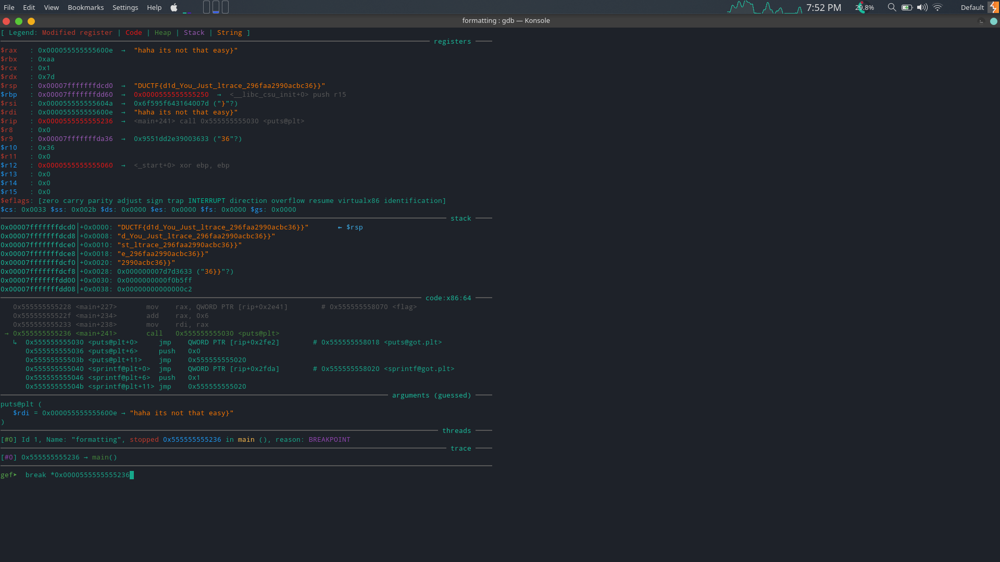

# Challenge Name : Formatting

# Description : 

Its really easy, I promise

## Analysing the binary

The decompilation from cutter is as follows

```
undefined8 main(void)
{
    int32_t iVar1;
    char *s;
    undefined var_79h;
    int64_t var_78h;
    int64_t var_20h;
    undefined4 var_18h;
    int64_t var_14h;
    int64_t var_8h;
    
    var_14h._0_4_ = 0x66;
    var_18h = 0x6c;
    var_78h._0_1_ = 0;
    s._0_1_ = 0x44;
    s._1_1_ = 0x55;
    s._2_1_ = 0x43;
    s._3_1_ = 0x54;
    s._4_1_ = 0x46;
    s._5_1_ = (undefined)_brac0;
    var_79h = (undefined)_brac1;
    iVar1 = sprintf((int64_t)&s + 6, _fmt, "d1d_You_Just_ltrace_", _this, _crap, _is, _too, _easy, _what, _the, _heck);
    var_20h = (int64_t)iVar1;
    *(char *)((int64_t)&s + var_20h + 6) = (char)_brac1;
    puts(_flag + 6);
    return 0;
}
```

The decompilation pretty much shows what the flag will actually look like and what can be the result.

However, on executing the binary, the result is :

```
./formatting 
haha its not that easy}
```

## Dynamic analysis of the binary

On loading the binary in gdb place a breakpoint at the puts@plt call. As soon as it hits the breakpoint there, you will get the flag in the stack.

```
gef➤  break *0x0000555555555236
```




